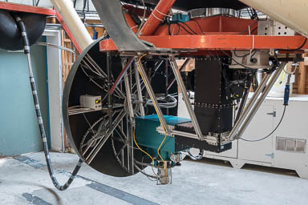

# RATIR: Instrument

*Note: RATIR was removed from the telescope in June 2022.*

## Architecture

The architecture of RATIR is shown in Figure 1. Three dichroics are used
to image the same field with four channels. The dichroics reflect
shortwards of 0.69, 0.83, and 1.03 µm and transmit longwards of these
wavelengths.

Figure 1. The architecture of RATIR, showing how three dichroics divide
light between four channels.

The four channels are:

* C0. This uses a Fairchild 3041 CCD with a UV coating. The detector
format is 2048 × 2048 pixels each 15 µm square, but the CCD is always
binned 2 × 2 to give 0.32 arcsec pixels. The total field of view is 5.4
arcmin square. This CCD is be equipped with a filter wheel containing up
to ten 50 mm diameter filters.
    
* C1. This uses another Fairchild 3041 CCD, but this time with a
broad-band coating rather than a UV-optimized coating. The scale and
field are close to that of the C0 channel. This CCD is equipped with a
fixed SDSS <i>i</i> filter.
    
* C2. This uses a HAWAII-2RG detector with a 1.7 µm cut-off. The
detector format is 2048 × 2048 pixels each 18 µm square. Powered optics
give a pixel scale of about 0.30 arcsec and a field of about 10 arcmin.
A fixed filter is installed close to the focal plane. The filter is
split along a N-S axis, with the eastern half of the detector being
imaged in a WFCAM <i>Z</i> filter and the western half in WFCAM <i>Y</i> filter. The
45-arcsec wide strip centered on the join is not imaged cleanly.
    
* C3. This uses another HAWAII-2RG detector with a 2.5 µm cut-off behind
the same powered optics as the C2 channel. Again, a split filter close
to the focal plane images the eastern half of the detector in MKO <i>J</i> and
the western half in MKO <i>H</i>.
    

## Fields

Figure 2 shows the instantaneous fields of the detectors. The effective
field of view will depend on the dithering strategy:

* If one wishes to obtain images in <i>riZYJH</i>, one needs to
dither between the two regions common to <i>riZJ</i> and <i>riYH</i>. If
this is done, the effective field of view will normally be slightly
smaller than 2.7 × 5.4 arcmin.
    
* If one wishes to obtain images in <i>ZYJH</i>, ignoring the CCDs, one
needs to dither between the two regions common to <i>ZJ</i> and <i>YH</i>. If this
is done, the effective field of view will normally be slightly smaller
than 5 × 10 arcmin.
    
* If one wishes to obtain images only with the CCDs, the effective field
of view will be 5.4 × 5.4 arcmin.
    

Of course, it is possible to map larger areas by mosaicing multiple
fields.

Figure 2. The approximate fields over the RATIR detectors. Any of the
filters in the filter wheel can substitute for the <i>r</i> filter.

## Filters

The C0 channel has a 10-position filter wheel for 50-mm round filters.
We intend that the SDSS <i>ugr</i> filters be always installed in the filter
wheel. The CATT will decide which additional filters will be installed
in the other seven slots in the filter wheel, from possibilities that
include:

*   Bessell <i>UBV</i>
*   Strömgren-Crawford <i>uvbyNW</i>
*   Nebular filters such as H&alpha;.

Note that the D1 dichroic transmits to the red of 690 nm, so redder
filters are not useful in the C0 filter wheel. This means that Bessell
<i>RI</i> are not available with RATIR.

The filters that are currently installed are listed in the [status](status.html) page.

The C1, C2, C3, and C4 channels have fixed <i>i</i>, <i>ZY</i>, and <i>JH</i> filters.

## Sensitivity

The sensitivity of RATIR is given in limiting AB magnitudes in
<i>ugri</i> and limiting Vega-based magnitudes for <i>UBV</i>. To convert AB
magnitudes to approximate Vega-based magnitudes, see Table 7 of Hewett
et al. (2006, MNRAS, 367, 454).
 
The estimated point-source 10-sigma limiting magnitudes in 60 seconds
are shown in Table 1. These limits do not include any penalty for sky
subtraction and assume image quality of 1.5 arcsec FWHM. We envisage
that most infrared observations will be carried out with 60 second
exposures, as this exposure time is needed to reach the background limit
in <i>iZYJH</i>.

Table 1: 10-sigma limiting magnitudes in dark and bright time in 60 seconds.

 
<table>
<tr><th>Filter</th><th>Dark</th><th>Bright</th><th>Magnitude Type</th></tr>
<tr><td><i>u</i></td><td>18.5</td><td>18.3</td><td>AB</td></tr>
<tr><td><i>g</i></td><td>21.0</td><td>20.4</td><td>AB</td></tr>
<tr><td><i>r</i></td><td>20.5</td><td>20.2</td><td>AB</td></tr>
<tr><td><i>i</i></td><td>20.3</td><td>19.8</td><td>AB</td></tr>
<tr><td><i>Z</i></td><td>19.6</td><td>19.4</td><td>AB</td></tr>
<tr><td><i>Y</i></td><td>19.2</td><td>19.2</td><td>AB</td></tr>
<tr><td><i>J</i></td><td>19.4</td><td>19.4</td><td>AB</td></tr>
<tr><td><i>H</i></td><td>18.6</td><td>18.6</td><td>AB</td></tr>
<tr><td><i>U</i></td><td>18.0</td><td>17.9</td><td>Vega</td></tr>
<tr><td><i>B</i></td><td>20.4</td><td>20.2</td><td>Vega</td></tr>
<tr><td><i>V</i></td><td>20.4</td><td>20.2</td><td>Vega</td></tr>
</table>
