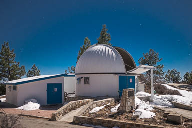

# RATIR: Telescope and Mount

*Note: RATIR was removed from the telescope in June 2022.*

## Location

The telescope is located at the [Observatorio Astronómico Nacional](http::/www.astrossp.unam.mx/) in the Sierra de San Pedro Mártir in Baja California, México, at [31°02’43.55” N 115°28’01.25” W](https://goo.gl/maps/ZYQLKPCScr82) and at an altitude of 2790 meters.

## Pointing Limits

The telescope can point between +57° and -27.5° in declination, ±5h20m in hour angle, and up to 85° in zenith distance.

## Pointing and Offsetting Precision

The typical pointing precision of the telescope is about 15 arcsec RMS.

The typical offset precision is about 2 arcsec RMS. Offsets of up to a few arcmin take about 10 seconds.

## Delivered Image Quality

The typical delivered image quality of the telescope is about 1.5 arcsec FWHM in all filters.

Prior to the installation of the RATIR instrument, the median intrinsic image quality of the telescope was shown to be 1.0 arcsec FWHM in <i>I</i> in 10 second exposures. However, vibrations induced by the RATIR cryocooler cold head lead to typical images with 1.5 arcsec FWHM. We suspect the cold head excites vibrations in the secondary, since this is not rigidly supported.
